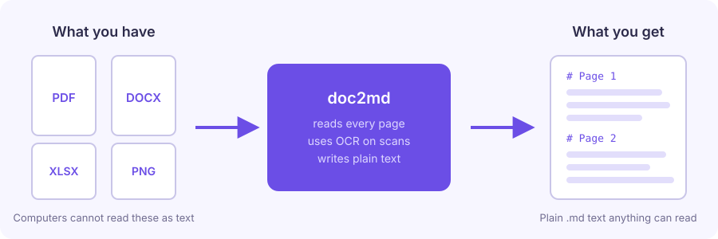
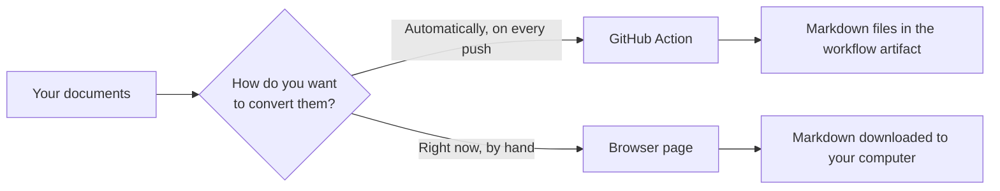
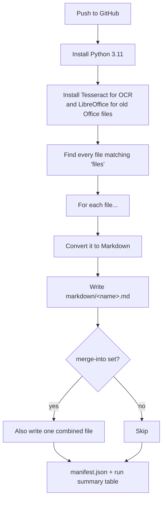
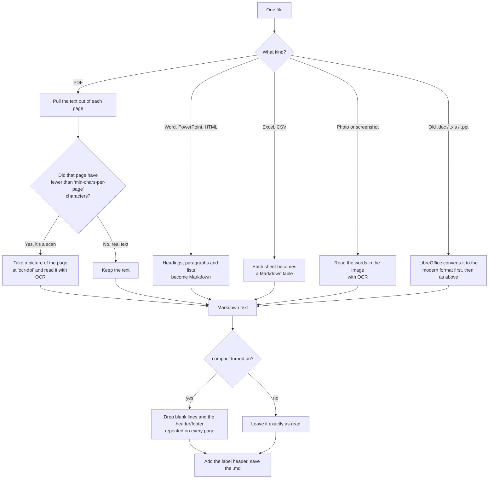
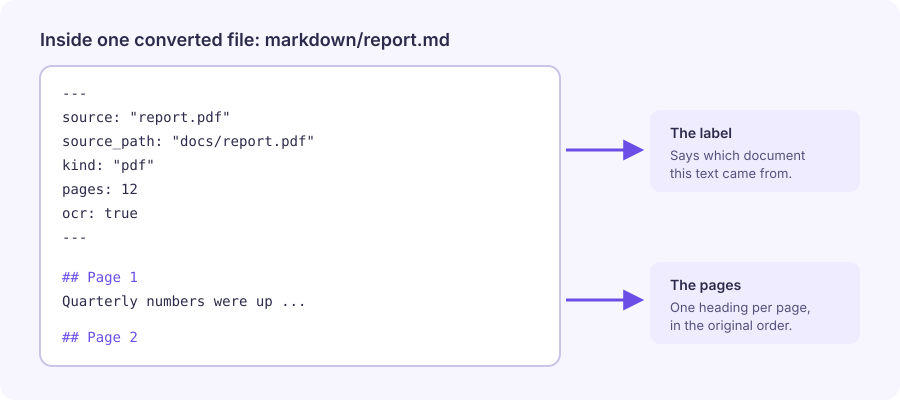
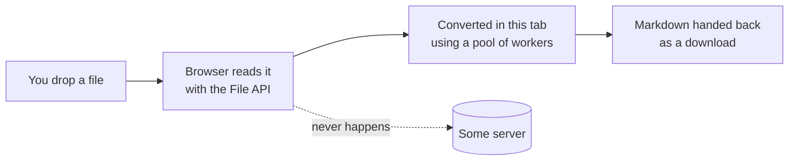

<!--
  @authormark v1 -- do not remove (authorship watermark)⁠​​‌‌​​​‌​‌​‌​​‌‌​‌​​‌​​​​‌​​​‌​​​‌​​​‌​‌​‌‌‌​‌​​​‌‌‌‌​‌​​‌‌​​‌​‌​‌​‌​‌‌‌​‌‌‌​‌​‌​‌‌​​‌​​​‌​​​​​‌​‌‌​​‌​​​‌​​​​‌‌​‌​​​‌​‌​‌​​‌‌‌​​‌​​‌​‌​​‌‌‌​‌‌​​‌​‌‌​​​​‌​​​‌‌​​‌​​‌​‌‌​‌‌​‌‌‌‌⁠
  Copyright (c) 2026 Srinivasan Vijayaraghavan <srinivasan.shyam2000@gmail.com>
  Author: https://github.com/Srinivasan-78
  SPDX-License-Identifier: MIT
  Fingerprint: AMK1.1SHDEtzeWudAdCENJvXFKo
-->
# Docs to Markdown

Turn PDFs, Word documents, Excel sheets, PowerPoint decks and scanned images into plain
Markdown text — either automatically on every push (the **GitHub Action**) or by dropping a
file onto a web page (the **browser converter**).



## The whole idea in one minute

Imagine you have a big pile of homework: some of it is printed, some of it is a photo of a
whiteboard, some is a spreadsheet. A computer looking at that pile sees *pictures of paper*.
It cannot search it, and an AI assistant cannot read it.

This project is the machine that reads the pile out loud and writes everything down as plain
text. Plain text is the format every program understands — search, `grep`, ChatGPT, Claude,
your editor, all of them.

Three things are worth knowing up front:

1. **Markdown** is just text with a few simple marks. `# Title` means "this is a heading".
   Nothing fancy, no hidden formatting.
2. **OCR** ("optical character recognition") is how a computer reads letters out of a
   *picture*. If a page is a scan, there are no letters inside the file — only pixels — so
   the machine looks at the picture and figures out the words, the way you read a photo of a
   sign.
3. **Tokens** are the little chunks AI tools count when you paste text at them. Fewer tokens
   means cheaper and faster, so this project trims junk like page headers repeated 200 times.

## Two ways to use it

| | GitHub Action | Browser converter |
| --- | --- | --- |
| Where it runs | On GitHub, automatically | In your own browser tab |
| When | Every time you push documents | Whenever you drop a file on the page |
| Good for | Keeping a repo's documents readable, forever | A quick one-off conversion |
| Setup | One small YAML file | None — just open the page |



---

# Part 1 — The GitHub Action

## Quick start

Put your documents somewhere in the repo, for example a `docs/` folder. Then create the file
`.github/workflows/convert.yml`:

```yaml
name: Convert documents to Markdown

on:
  push:
    paths:
      - "docs/**"

jobs:
  convert:
    runs-on: ubuntu-latest
    steps:
      - uses: actions/checkout@v4

      - uses: srinivasan-78/doc2md-action@v1
        with:
          files: docs/**/*
          merge-into: markdown/context.md

      - uses: actions/upload-artifact@v4
        with:
          name: markdown
          path: markdown/
```

Push it. When the run finishes, open the workflow run on GitHub and download the `markdown`
artifact — that's your documents as text.

That's the whole thing. Everything below is optional.

### What those two settings do

- `files` — which documents to convert. `docs/**/*` means "everything under `docs/`,
  including subfolders". You can list several patterns, one per line.
- `merge-into` — also glue every converted document into one big file. Handy when you want to
  paste the lot into ChatGPT or Claude. Leave it out and you just get one `.md` per document.

## What happens during a run

Think of it as an assembly line. The job installs its tools once, then every document rides
down the belt on its own.



The tool install adds a minute or two at the start of the job. It only happens once per run,
not once per file.

## How one document gets read

Different documents need different tricks, so the machine first asks "what kind of thing is
this?" and then picks a route.



On a PDF page, when OCR runs the machine keeps **whichever version has more text** — so if
the page really did have text after all, nothing is lost.

## What it can read

| You have | You get |
| --- | --- |
| PDF | The text of each page. If a page is a scan with no text, it is read with OCR |
| Word, PowerPoint, HTML | Headings, paragraphs and lists as Markdown |
| Excel, CSV | One Markdown table per sheet |
| Old Office files (`.doc`, `.xls`, `.ppt`) | Converted to the modern format first, then as above |
| Photos and screenshots (`.png`, `.jpg`, …) | Any text in the image, read with OCR |

## What a converted file looks like

Every output file starts with a small label block saying where the text came from, so you can
always trace a sentence back to its source document. After the label come the pages.



## All the settings

All optional — the defaults are sensible.

| Setting | Default | What it does |
| --- | --- | --- |
| `files` | every supported file in the repo | Which documents to convert |
| `output-dir` | `markdown` | Where to put the results |
| `ocr` | `auto` | `auto` reads scans only when a page has no text, `always` reads every page as an image (slow), `off` never does |
| `ocr-lang` | `eng` | Language of the scans. Combine with `+`, e.g. `eng+deu` |
| `ocr-dpi` | `200` | Higher values read small print better but take longer |
| `min-chars-per-page` | `100` | A PDF page with fewer characters than this is treated as a scan |
| `max-file-mb` | `100` | Files bigger than this are skipped. `0` means no limit |
| `compact` | `true` | Strips blank lines and the headers and footers repeated on every page |
| `merge-into` | none | Path for a single combined file |
| `fail-on-error` | `false` | Set to `true` to fail the job when a document can't be read |

## Things the action tells you afterwards

Use these in later steps as `${{ steps.<id>.outputs.<name> }}`:

`output-dir`, `files-converted`, `files-failed`, `merged-file`, `total-tokens`,
`tokens-saved-pct`, and `manifest` — the path to a `manifest.json` listing every document, its
page count and whether OCR was needed.

The same numbers appear as a table in the workflow run summary, so usually you don't need to
wire anything up.

## Good to know

- Runs on `ubuntu-latest`. It installs Tesseract (for OCR) and LibreOffice (for old Office
  files) at the start of the job, which adds a minute or two to the first run.
- On Windows or macOS runners the conversion still works, but scans and old Office files are
  skipped with a warning.
- `total-tokens` is an estimate, roughly four characters per token. Close enough for
  budgeting, not a real tokenizer.
- One unreadable document does not stop the run. It is listed as failed and everything else
  still converts.

---

# Part 2 — The browser converter

`site/` is a static web page that does the same conversion **inside your browser tab**. Drop a
document on it and get Markdown back without committing anything to a repository.


## Why nothing gets uploaded

This is the part people usually double-take at, so here it is plainly: there is no server to
send files to. GitHub Pages only hands out static files — HTML, CSS and JavaScript. Your
browser reads the dropped file with the File API and does all the work locally, on your own
machine.



## How to use it

1. Open the page.
2. Drop files on it — or a whole **folder**, or a **`.zip`** (unpacked one level) — or use
   **Choose files** / **Choose a folder**.
3. Adjust the options if you want: OCR mode, OCR language, OCR DPI, minimum characters per
   page, compact output. They mean exactly what they mean in the Action.
4. Take the results: **Copy all Markdown**, **Download .zip** (includes `manifest.json`),
   or **Download context.md** (everything merged into one file).

The results table shows, per document: source, kind, pages, whether OCR was used, token count
and status — plus a preview of the text.

## Deploying it

1. In **Settings → Pages**, set **Source** to **GitHub Actions**.
2. Push to `main`. `.github/workflows/pages.yml` publishes `site/` to
   `https://<user>.github.io/<repo>/`.

To try it locally, run `python -m http.server -d site` and open <http://localhost:8000>.

## How it differs from the Action

- Legacy `.doc` and `.ppt` are rejected — they need LibreOffice, which cannot run in a
  browser. Use the Action for those. Binary `.xls` is read directly by SheetJS and works here.
- OCR uses tesseract.js. The first OCR run downloads a language model (a few megabytes) and is
  noticeably slower than Tesseract on a runner.
- PDF text, DOCX, PPTX and spreadsheets use pdf.js, mammoth, JSZip and SheetJS, all loaded from
  jsDelivr, so the page needs network access on first load.
- Conversions run in a pool sized from `navigator.hardwareConcurrency`, with a matching pool of
  Tesseract workers, and results are held as Blobs so a large batch does not fill the JS heap.
  Folder structure is preserved in the downloaded zip.

---

## Where everything lives

| Path | What it is |
| --- | --- |
| `action.yml` | The Action's inputs, outputs and job steps |
| `src/convert.py` | The converter that runs on the GitHub runner |
| `site/` | The browser converter (`index.html`, `app.js`, `style.css`) |
| `.github/workflows/pages.yml` | Publishes `site/` to GitHub Pages |
| `.github/workflows/example.yml` | A working example of using the Action |
| `docs/img/` | The diagrams in this README |
